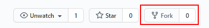
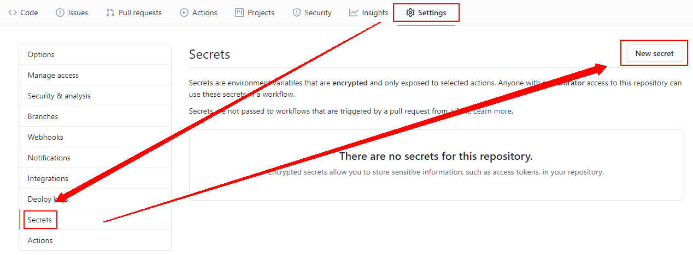
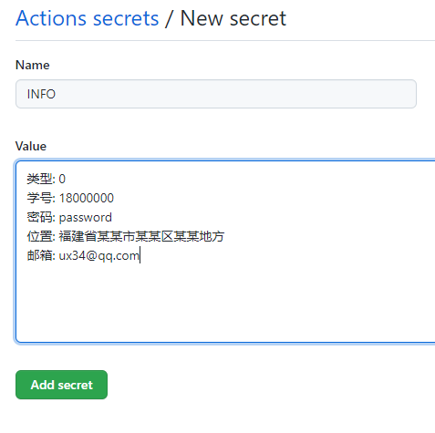
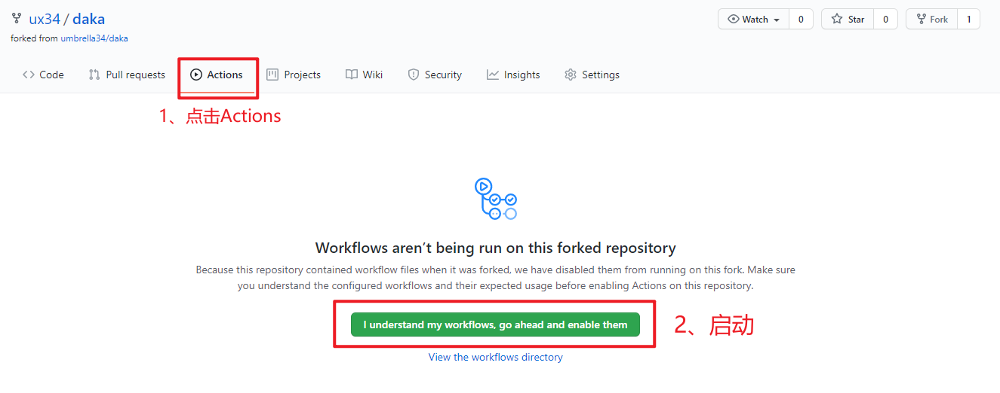
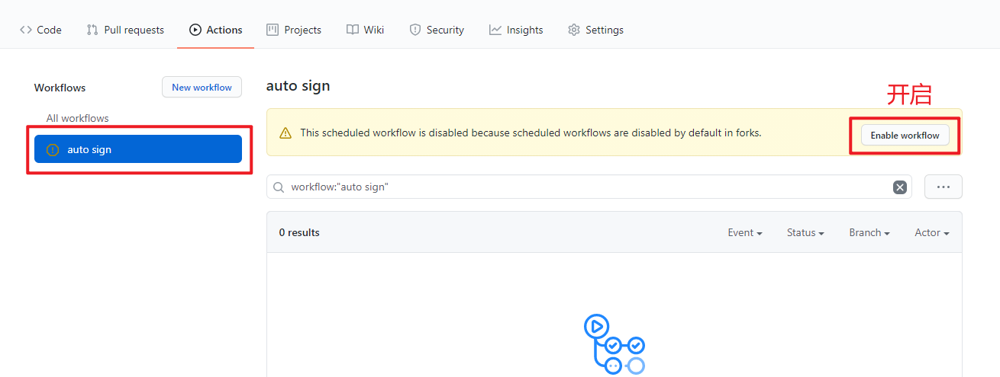
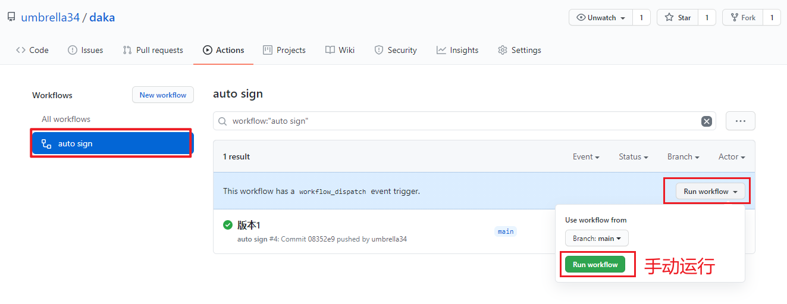
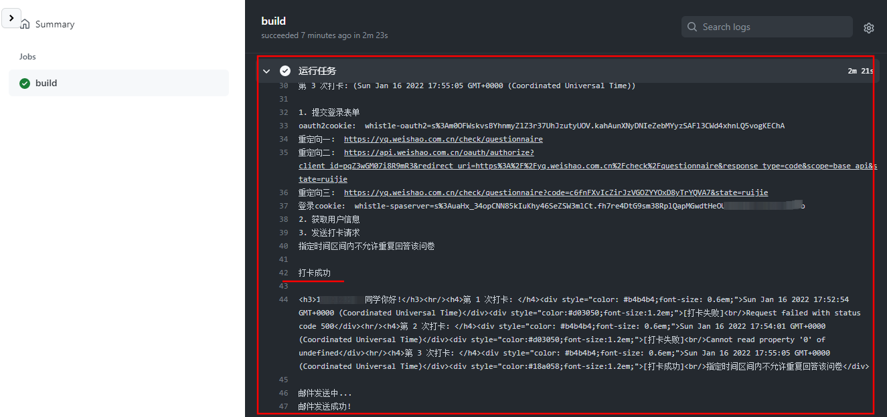
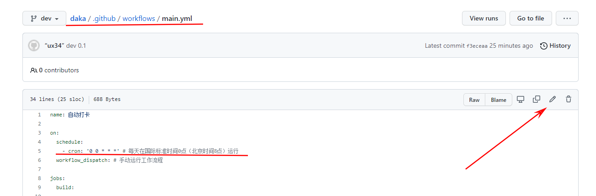

# ⏰daka 定时打卡

**XMUT微哨自动打卡**

**更新日志**

*   2022年6月25日

    *   毕业了，兄弟们再见！

*   2022年1月17日

    *   调整默认打卡时间为北京时间8点

    *   调整容错，打卡错误重试调至5次

    *   Secrets 配置支持 `yaml` 格式

    *   邮箱可直接配置在 Secrets  `INFO` 中

    *   网络请求模块 `node-fetch` 改成 `axios`

    *   邮箱反馈的内容及样式优化

## 📝前言

此案例仅供学习交流，如有不当之处请邮件通知我 `ux34@qq.com` 删除。

常常因为忘记打卡而感到烦恼，而打卡内容却基本没变过，为什么不写个程序自动打卡呢？

程序只是个懒人工具，情况有变还需要到手机APP上手动修改。

**如果觉得本项目对你有帮助，请顺手点个 `Star` 吧**

## 🎮使用须知

使用前需要用户自行配置 Secrets，需要填写类型及微哨的学号、密码、位置。

*   类型 **0**：默认 离校不在厦门

*   类型 **1**：离校在厦门，需要多填写一个 `社区` 字段

*   类型 **2**：在校 or 假期留校住宿

*   类型 **3**：离校在厦门租房，需要多填写一个 `社区` 字段

**默认填写：**

> 如果你当日不符合默认填写的选项，请到微哨APP上自行修改！

    你目前是否有发热?(>=37.3度)
    ：否

    你是否有...疑似症状?
    ：否

    近三日内是否有离开现居住地的意向？
    ：否

**离校在厦门的默认填写：**

    离校在厦门的选项分叉过多，这边只做了一种常见的选项

    住房类型？
    ：自家房产

    是否与家人（亲属）同住？
    ：是

    是否向所在社区报备？
    ：是

## 📐部署

> **如何更新：** 如果你不会使用git工具更新代码，建议直接删除该项目(`Setting` => `Delete this repository`)，然后重新部署一遍

1.  Fork 仓库

2.  添加信息 至 Secrets

3.  启用 Actions

### 1. Fork 仓库

*   项目地址：<https://github.com/umbrella34/daka>

*   点击右上角 `Fork` 到自己的账号下



### 2. 添加 信息 至 Secrets

*   回到项目页面，依次点击 `Settings` --> `Secrets` --> `New secret`





**请根据自身情况复制并修改对应的内容，也记得要及时更新内容哦**

> 建议使用邮箱提醒，哪怕5次打卡都失败的情况下，你也能及时去手动打卡
>
> 邮箱的配置移动到 INFO 中了，如果不填并把这行删除，单独设置 Secrets MAIL也是可以的（之前的版本）

#### 0、离校不在厦门

> YAML 格式

```yaml
类型: 0
学号: 你的学号
密码: 你的密码
位置: 你的位置
邮箱: 你的邮箱(可以不填)
```

> 或着也可以使用 JSON 格式, 下面就不举例了
>
> 建议使用 YAML 格式，JSON 少了点标点符号就会报错

```json
{
  "类型": 0,
  "学号": "你的学号",
  "密码": "你的密码",
  "位置": "你的位置",
  "邮箱": "你的邮箱(可以不填)"
}
```

#### 1、离校在厦门

```yaml
类型: 0
学号: 你的学号
密码: 你的密码
位置: 你的位置
社区: 所在街道社区名称及社区电话
邮箱: 你的邮箱(可以不填)
```

#### 2、在校

```yaml
类型: 2
学号: 你的学号
密码: 你的密码
位置: 你的位置
邮箱: 你的邮箱(可以不填)
```

#### 3、离校在厦门租房

[Isaac Rogers](https://github.com/yzalogR) 贡献的代码

```yaml
类型: 3
学号: 你的学号
密码: 你的密码
位置: 你的位置
社区: 所在街道社区名称及社区电话
邮箱: 你的邮箱(可以不填)
```

### 3. 启用 Actions

> Actions 默认为关闭状态，Fork 之后需要手动执行一次，若成功运行其才会激活。

返回项目主页面，点击上方的 `Actions`，点击绿色按钮 `I understand my workflows, go ahead and enable them`.

进去后点击左边的 `auto sign`, 在点击 `enable workflow` 即可。





至此，部署完毕。

## 🔍结果

**部署完毕先手动运行一次, 看看运行结果, 才能确定填写信息是否正确**



当你完成上述流程，可以在 `Actions` 页面点击 `auto sign` --> `build` --> `Run sign` 查看运行日志



如果不能有正确的结果，请返回第二步，重新配置

## ✨更多

**设置定时时间：**

修改 `/.github/workflows/main.yml` 文件中的 `schedule - cron`

如 `'0 16 * * *'` 是每天在国际标准时间16点（北京时间凌晨0点）运行，你可以改成你需要的时间。



**其他环境部署：**

在 `index.js` 文件中将上面配置的内容以字符串的形式给 `process.env['INFO']` 赋值即可，然后部署到自己的服务器（定时任务需要单独写）或云函数（云函数可以设置定时任务）

**关于打卡失败：**

大多数情况都是服务器返回500错误或者登录不成功，可能是网络太拥挤，也可能是服务器的请求限制，还有申请登录的时间间隔过短，只能多打几次来解决问题

## ❗️协议

使用 daka 即表明，您知情并同意：

*   此代码通过模拟浏览器使用学号密码登录微哨网页，提交表单完成打卡。

*   用户Secrets上的信息被储存于 Github 服务器，只供本项目使用。若 Github 服务器被攻破，则您的 Secrets有遭到泄露的风险。除此之外，开发者无权获取您的 Secrets；即使是用户，一旦创建完成Secrets，也无法再次从中查看信息

*   daka 不会对您的任何损失负责，包括但不限于打卡失败、被辅导员叫去问话等
